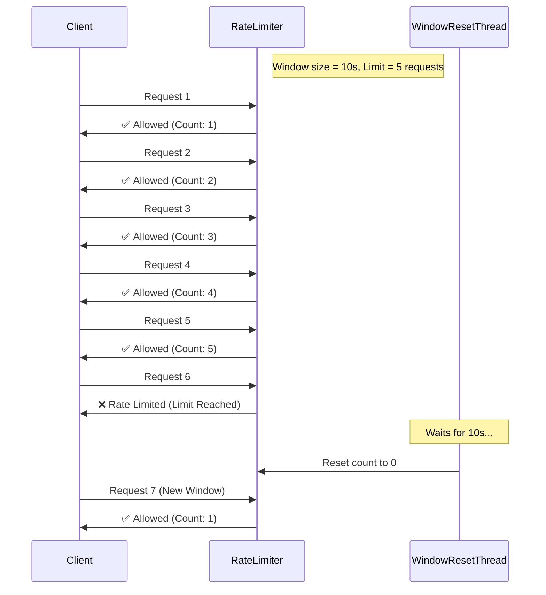
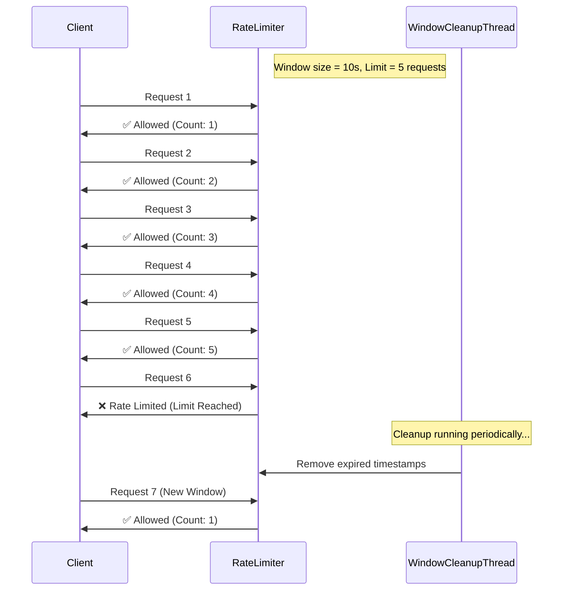

# Handling Rate Limits Effectively

We spoke a bit on Javascripters with some bright individuals about a practical problem 
that needed rate limiting and so this is a followup disguised in the form of a talk session about practical rate limiting

The goal of this is not to be algorithmically precise to a tee, but to show real-world approaches 
to limiting request/traffic. This I broadly divide into `Windows vs Buckets` as they each have different
appeals

## Introduction

Rate limiting is crucial and perhaps most popularly known
due to the monster we are all aware of called denial of service
but it also has a lot of advantages and use cases such as

- Fair Usage Enforcement: No single user should be able to erect a monopoly and bully
others out of resources.
- Cost Management: Helps control unexpected operational costs, giving rise to the ability
to properly estimate expected traffic and plan for it
- Contract Negotiations: Some customers need more than others and are often willing to pay
for it, so this becomes another lever to pull during contract negotiations

## Dependencies

Rust(cargo) simply because I suck the least in Rust

## Windows

### Fixed Window

This divides time into fixed length intervals with request counters. 
Has issues with burstiness and is often not fair for distributed request
patterns

### Sliding Window

As the name implies, the window is sliding and what that means is that 
doesn't reset at fixed intervals but maintains a rolling count over time
It is more resistant to burstiness

## Buckets

### Token Bucket

The major selling point of this approach is it's ability to process bursty traffic i.e traffic 
by saving tokens. So it often closely mimics real life as traffic patterns are very often spiky
in nature.

### Leaky Bucket

Works best to smooth request traffic. Generally simpler and is much more suited to traffic 
and congestion control than it is rate limiting

## Weighted Requests

Not every request consumes the same amount of resources and so whatever ratelimiting strategy
is being used must account for this by weighting each request type with the amount it typically
consumes.

## Distributed Rate Limited

### Redis

So far we've dealt with mostly with intra-service rate limiting and these approaches
do not account for multiple replicas of a backend instance... the approaches that do
account, are simply just using persistence that can be accessed by 

[Redis-Cell](https://github.com/brandur/redis-cell/tree/master) is a honorable mention
as it is a redis add-on that provides a single atomic command for rate limiting and it uses
[Generic Cell Rate Algorithm](https://en.wikipedia.org/wiki/Generic_cell_rate_algorithm) which
is a variation of leaky bucket algorithm 

### Queues

Not everything needs to be real-time, so learn to move things over to
async processes like queues that then let you consume at reasonable rates without dropping
or loosing requests.

## SYN ACK Flood

We are familiar with the 3-way TCP handshake which occurs in order to establish a connection
This can still be leveraged to bypass rate limiting if the goal is ultimately to cause denial
of service
[SYN Ack flood](https://www.cloudflare.com/en-gb/learning/ddos/syn-flood-ddos-attack/)

